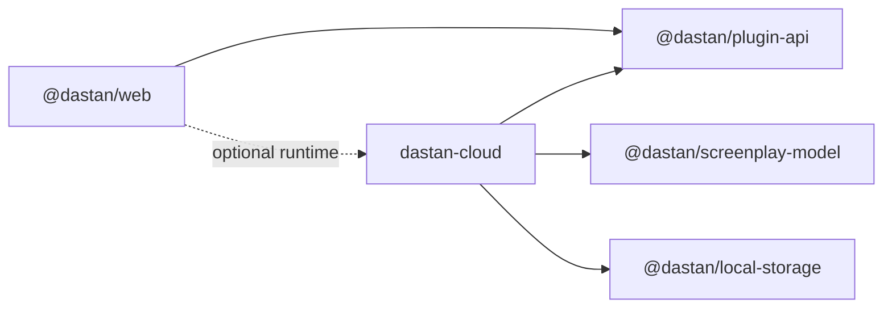

# Dastan Cloud (private repository)

This document describes the planned **dastan-cloud** proprietary repository and how it integrates with the public AGPL monorepo. The cloud repo is not part of npm workspaces.

A local scaffold lives in [`cloud/`](../cloud/) for reference until the private repository is created.

## Philosophy

> Cloud services are optional extensions, not dependencies.

The public `@dastan/web` app must remain fully usable offline with zero cloud configuration. The private repo **imports** public packages — never the reverse.

## Repository layout

```text
dastan-cloud/
  auth/              # Supabase Auth wrappers
  billing/           # Stripe subscriptions, plan resolution
  quota-system/      # Free-tier daily AI prompts
  ai-gateway/        # DastanCloud provider + memory compression
  memory/            # Cloud-persisted AI memory (Pro)
  sync/              # Document sync, backups, version history
  collaboration/     # Writer rooms, comments, permissions
  analytics/         # Product analytics (optional)
  enterprise/        # SSO, audit logs, admin controls
```

## Adapter registration contract

Cloud modules implement interfaces from `@dastan/plugin-api` and register at app bootstrap in `@dastan/web`.

### Environment

```bash
VITE_DASTAN_CLOUD_URL=https://cloud.dastan.example
```

When set, the web app calls `registerCloudAdapters(services, cloudUrl)` before rendering.

### Required implementations

| Interface | Package | Purpose |
|-----------|---------|---------|
| `StorageBackend` | `sync/` | Optional overlay; local IndexedDB remains source of truth offline |
| `SyncService` | `sync/` | Cross-device sync, backups |
| `AuthService` | `auth/` | Sign-in, sessions |
| `ShareService` | `collaboration/` | Real invite links and permissions |
| `CollaborationService` | `collaboration/` | Real-time co-editing, presence, shared AI chat broadcast |
| `QuotaService` | `quota-system/` | Server-enforced free tier |
| `Entitlements` | `billing/` | Pro / Enterprise feature gates |
| `AiProviderAdapter` (`dastan-cloud`) | `ai-gateway/` | Managed AI without BYOK |

### Registration example

```typescript
import { createDastanApp } from '@dastan/web/bootstrap';
import { registerCloudAdapters } from '@dastan-cloud/bootstrap';

const services = createDastanApp({ cloudUrl: import.meta.env.VITE_DASTAN_CLOUD_URL });

if (import.meta.env.VITE_DASTAN_CLOUD_URL) {
  await registerCloudAdapters(services, import.meta.env.VITE_DASTAN_CLOUD_URL);
}

// Pass `services` to <DastanAppProvider services={services}>
```

Cloud registration must:

1. Call `services.aiProviders.register(dastanCloudProvider)` *(deferred — ai-gateway phase)*
2. Replace `services.sync`, `services.auth`, `services.share`, `services.quota`, `services.entitlements`, and `services.collaboration`
3. Never patch or fork `@dastan/editor`, `@dastan/screenplay-model`, or other core packages

### Local development linking

When developing with the gitignored `cloud/` folder nested inside the public repo:

1. Set in `.env.local`:
   ```bash
   VITE_DASTAN_CLOUD_URL=http://localhost:5173
   VITE_SUPABASE_URL=https://<your-project-ref>.supabase.co
   VITE_SUPABASE_PUBLISHABLE_KEY=<your-anon-key>
   ```
2. `@dastan/web` resolves `@dastan-cloud/bootstrap` via a Vite alias to `cloud/bootstrap/index.ts`.
3. Run migrations from `cloud/`: `npm run supabase:push` (after `supabase link`).
4. Deploy `join-room`: `npm run supabase:deploy:join-room`.

Production builds should depend on a published `@dastan-cloud/bootstrap` package or a git dependency with deploy-time credentials.

### Dependency direction



Install public packages from npm or git tags:

```json
{
  "dependencies": {
    "@dastan/plugin-api": "^0.1.0",
    "@dastan/screenplay-model": "^0.1.0"
  }
}
```

## Rollout order

1. **ai-gateway + quota-system** — free daily prompts via `dastan-cloud` provider (keep BYOK working)
2. **auth + sync** — Pro tier cloud backup
3. **memory** — cloud AI memory (Pro)
4. **collaboration + enterprise** — writer rooms, presence, shared AI threads, SSO

See [REALTIME-COLLABORATION.md](./REALTIME-COLLABORATION.md) and [COLLABORATION-CLOUD-SPEC.md](./COLLABORATION-CLOUD-SPEC.md).

## What stays in the public repo

- All writing, export, offline, and plugin features
- BYOK AI providers (`openai`, `anthropic`, `google`, `openrouter`, `ollama`)
- Local storage and default `freeEntitlements`
- Supabase edge function for dev BYOK proxy until `ai-gateway` ships
