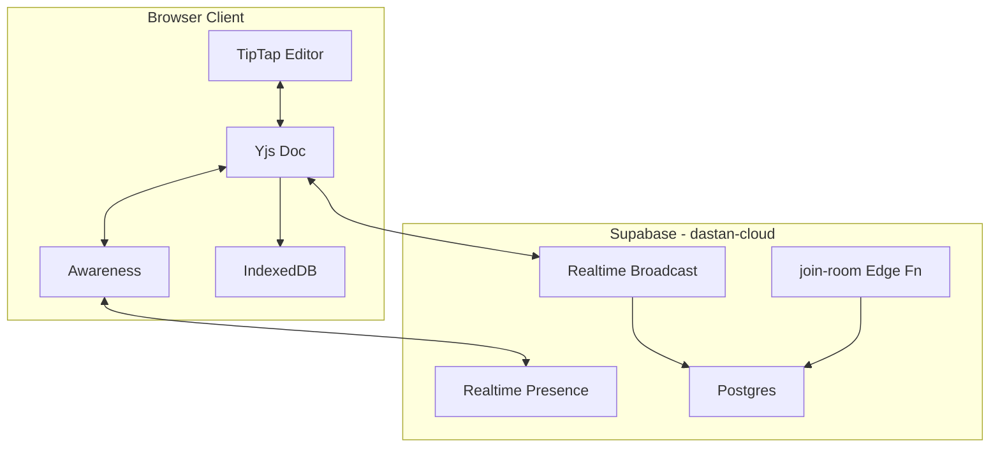

# Real-Time Collaboration + Cloud/AI Integration

This document describes Dastan's real-time collaboration architecture: Yjs CRDTs bound to TipTap/ProseMirror, transported over Supabase Realtime (Broadcast + Presence), with IndexedDB as the offline-first source of truth and Postgres holding shared-document state for cloud-synced docs.

See also: [COLLABORATION-CLOUD-SPEC.md](./COLLABORATION-CLOUD-SPEC.md) for the private `dastan-cloud` Postgres schema, RLS policies, and `join-room` edge function spec.

## Decisions

| Area | Choice | Rationale |
|------|--------|-----------|
| CRDT | Yjs + `y-prosemirror` | TipTap's official `@tiptap/extension-collaboration` is Yjs-based |
| Transport | Supabase Realtime Broadcast + Presence | Reuses existing Supabase infra; CRDT merge is client-side so a dumb relay is safe |
| Persistence | IndexedDB primary; Postgres for cloud-shared docs | Matches [CLOUD-REPO.md](./CLOUD-REPO.md) philosophy |
| AI chat | Shared room-scoped thread | All collaborators see the same AI conversation live |

### Transport tradeoff

Supabase Broadcast does not guarantee message ordering on reconnect. Yjs updates are commutative/idempotent, so peers converge; periodic full-state resync from `doc_snapshots` mitigates missed diffs. A dedicated Yjs server (Hocuspocus) can replace the transport later without changing client CRDT logic.

## Architecture

## Public repo implementation

### Plugin API (`@dastan/plugin-api`)

- `CollaborationService` — `isAvailable()`, `openRoom()`, `closeRoom()`
- `CollaborationRoom` — `connect()`, `onPeersChange()`, `subscribeChatMessages()`, `publishChatMessage()`
- `CollaboratorPresence` — user id, name, color, optional cursor block index
- Registered on `DastanServices.collaboration`

### Local stub (`apps/web/src/services/local-collaboration.ts`)

Returns `isAvailable() === false`. No-op room for offline-only mode. Cloud bootstrap replaces this when `VITE_DASTAN_CLOUD_URL` is set.

### Editor integration

- [`packages/editor/src/extensions/createCollaborationExtensions.ts`](../packages/editor/src/extensions/createCollaborationExtensions.ts) — TipTap Collaboration + CollaborationCursor
- [`apps/web/src/collaboration/load-collaboration-bundle.ts`](../apps/web/src/collaboration/load-collaboration-bundle.ts) — **dynamic import** of Yjs + collaboration extensions (code-split chunk)
- [`apps/web/src/hooks/useDocumentCollaboration.ts`](../apps/web/src/hooks/useDocumentCollaboration.ts) — manages Yjs doc lifecycle per document
- [`apps/web/src/components/ScreenplayEditor.tsx`](../apps/web/src/components/ScreenplayEditor.tsx) — conditionally loads collaboration; omits History when collab is active

### Presence UI

- [`apps/web/src/components/CollaboratorAvatars.tsx`](../apps/web/src/components/CollaboratorAvatars.tsx) — avatar stack in editor TopBar
- Cursor decorations via `@tiptap/extension-collaboration-cursor`

### Shared AI chat

- `AiChatThread.roomId` — optional field (defaults to `documentId` when collab is active)
- [`apps/web/src/hooks/useCollaborationChatSync.ts`](../apps/web/src/hooks/useCollaborationChatSync.ts) — subscribes to live chat broadcasts
- [`apps/web/src/utils/collaboration-chat.ts`](../apps/web/src/utils/collaboration-chat.ts) — message merge helpers
- AI system prompt includes active collaborators via `buildAiContext({ activeCollaborators })`

### Share / ACL

Existing `ShareService` + `SharePermission` (`view` | `comment` | `edit`) are the room ACL contract. Cloud `ShareService.sendInvite` writes `share_invites` rows; `join-room` validates access before issuing Realtime tokens.

## Phased rollout

1. **Done (public repo)** — plugin-api interfaces, local stub, Yjs editor wiring, presence UI, shared chat hooks, docs
2. **dastan-cloud** — Postgres schema + RLS + `join-room` + Supabase Realtime provider
3. **Pro entitlements** — `canUseCloudSync()` flips true for paid plans
4. **Live script notes** — sync `workspace.scriptNotes` via Yjs `workspace` map on the shared doc
5. **AI tool-calling** — agent edits broadcast as `yjs-update` events (same pipe as human collaborators)

## Key risks

- **Reconnect ordering** — mitigate with periodic `doc_snapshots` full-state resync
- **Decoration conflicts** — verify collaboration cursors don't clash with dual-dialogue / script-note markers
- **Bundle size** — collaboration loads via dynamic `import()` only when `collaboration.isAvailable()`
- **Security** — never trust client-supplied `documentId` alone; `join-room` must issue scoped Realtime tokens
